<p align="center">
  
</p>

# Skills

> Reusable [Claude Code](https://docs.anthropic.com/en/docs/claude-code) and Codex skills for autonomous
> development workflows — issue triage, PR shepherding, session memory, and more.
>
> _From the wildflower meadows of Colorado, with love._

Skills are command skills that teach Claude Code and Codex _how_ to do complex, multi-step tasks. They're
plain Markdown files with structured instructions — readable by humans, executable by bots. Think of
them as detailed trail guides: clear enough for anyone to follow, thorough enough to reach the
summit without hand-holding.

This repo is designed for a **worktree-based workflow**: multiple agent sessions running in
parallel via `git worktree`, each on its own branch, blazing its own trail to the summit.

## Quick Start

### Linux / macOS

```sh
git clone git@github.com:bkonkle-dev/skills.git ~/code/bkonkle/skills
cd ~/code/bkonkle/skills
./setup.sh
```

To install a single skill:

```sh
./install-skill.sh <skill-name>
```

### Windows

**Git Bash (recommended)** — works without elevated privileges:

```sh
git clone git@github.com:bkonkle-dev/skills.git ~/code/bkonkle/skills
cd ~/code/bkonkle/skills
bash setup.sh
```

To install a single skill:

```sh
bash install-skill.sh <skill-name>
```

**PowerShell** — requires Developer Mode (Settings > For developers) or an elevated (admin) prompt:

```powershell
git clone git@github.com:bkonkle-dev/skills.git ~\code\bkonkle\skills
cd ~\code\bkonkle\skills
.\setup.ps1
```

To install a single skill:

```powershell
.\install-skill.ps1 <skill-name>
```

---

Skills are symlinked into `~/.claude/skills/` and `~/.codex/skills/`, so changes to this repo are
reflected immediately —
pull the repo and you're up to date. No reinstall needed.

## Skills

| Skill | Command | What it does |
|-------|---------|-------------|
| **AWS Cost Check** | `/aws-cost-check` | Audits your AWS account for runaway costs, forgotten resources, and free tier overages |
| **Batch Merge** | `/batch-merge` | Queue helper for multi-PR runs; delegates sequential merging workflow |
| **Cleanup** | `/cleanup` | Prunes stale branches, checks for uncommitted work, reminds about session memories |
| **Pick Up and Merge** | `/pick-up-and-merge` | One-command issue-to-merge pipeline that wraps claim, implementation, shepherding, and cleanup |
| **Pick Up Issue** | `/pick-up-issue` | Finds an unassigned issue, claims it, implements a fix, opens a PR, and shepherds it to merge |
| **Preflight** | `/preflight` | Validates repo identity, branch state, CI health, and open PRs before you start work |
| **Recall** | `/recall` | Loads relevant prior context from layered session memory and archived transcripts before implementation |
| **Session Memory** | `/session-memory` | Maintains layered memory (session artifact, daily log, durable memory) so future sessions can reuse decisions reliably |
| **Shepherd to Merge** | `/shepherd-to-merge` | Single-PR or sequential queue mode: reviews, fixes feedback, rebases, and auto-merges |
| **Status** | `/status` | One-shot dashboard for open PRs/issues with stuck PR detection |
| **TDD** | `/tdd` | Enforces a red-green-refactor workflow to keep changes test-first and regression-resistant |

### Lifecycle

These skills aren't standalone — they compose into a full development lifecycle, like
switchbacks up a fourteener:

```mermaid
graph LR
    P[🏔️ /preflight] --> I[🥾 /pick-up-issue]
    I --> S[⛰️ /shepherd-to-merge]
    I -.-> B[🗻 /batch-merge]
    S --> C[🌲 /cleanup]
    B --> C
    C -.-> P
```



`/recall` should run before implementation to load prior context; `/session-memory` runs during and
after implementation to persist new context so future sessions can reuse it.

`/tdd` is a cross-cutting helper that fits inside implementation steps of `/pick-up-issue` and
ad-hoc feature work.

`/status` is an operational check-in skill you can run anytime between lifecycle steps.

If you want fewer operator decisions, use `/pick-up-and-merge` as the single-entry variant of the
full lifecycle.

## Extras

- **`statusline/statusline.sh`** — CLI statusline showing session name, context %, cost, and model.
  Detects worktree names from `.claude/worktrees/<name>/` and `.codex/worktrees/<name>/` paths.
- **`hooks/`** — Hook scripts (empty for now — add hooks as needed).

## Updating

```sh
cd ~/code/bkonkle/skills && git pull
```

Since skills are symlinked, existing ones update automatically. Run `./setup.sh` (or `.\setup.ps1`
on Windows) again only to pick up newly added skills or hooks.

## Writing New Skills

A skill is a directory under `skills/` containing a `SKILL.md` file with YAML frontmatter:

```markdown
---
name: my-skill
description: One-line description shown in /help
argument-hint: <optional args>
---

# My Skill

Instructions go here. Write them like you're onboarding a sharp colleague
who's never seen the codebase — enough context to be autonomous, not so
much that it's a novel.
```

After adding a new skill, run `./setup.sh` (or `.\setup.ps1` on Windows) to symlink it into
`~/.claude/skills/` and `~/.codex/skills/`.

Good skills are **specific**, **sequential**, and **verifiable** — they tell the agent what to do,
in what order, and how to know it reached the summit.

## Common Pitfalls

Cairns marking where others have stumbled:

| Problem | Cause | Fix |
|---------|-------|-----|
| Wrong repo targeted | Agent derived repo from wrong remote | Use explicit `owner/repo` argument |
| Push to wrong branch | Didn't verify tracking before push | Run `git branch -vv` before pushing |
| CI won't trigger | Stale workflow YAML on branch | Rebase onto latest main |
| Worktree branch conflict | Tried to switch to `main` | Use `claude/<worktree-name>` or `codex/<worktree-name>` instead |
| Cache misses after runner change | Mixed cache actions | Use repo's standard cache action consistently |
| Repeated work | Didn't check prior sessions | Run `/recall` and read relevant layered memory + transcript hits before implementing |
| Stranded session memories | Memory committed to worktree branch, not in PR | Finalize memory before shepherding; `/cleanup` checks for orphans |

## CLAUDE.md Integration

Skills are generic — they work across repos. For repo-specific behavior, add context to the repo's
`CLAUDE.md` or `AGENTS.md`:

- **Repository identity** — correct org/repo name to prevent wrong-repo targeting
- **CI architecture** — runner type, cache action, build constraints
- **Branch conventions** — naming patterns, protected branches
- **Verification commands** — test/lint/build commands for the project's toolchain

Skills like `/preflight` read `AGENTS.md`/`CLAUDE.md` to validate architecture constraints, so keeping those files
accurate directly reduces agent mistakes.

## License

MIT

---

<p align="center"><sub>Happy trails from the high country.</sub></p>
<p align="center"><sub>Banner: <a href="https://unsplash.com/photos/jiTG4IQo3o4">Alpine Meadow</a> by Brice Cooper on Unsplash</sub></p>
